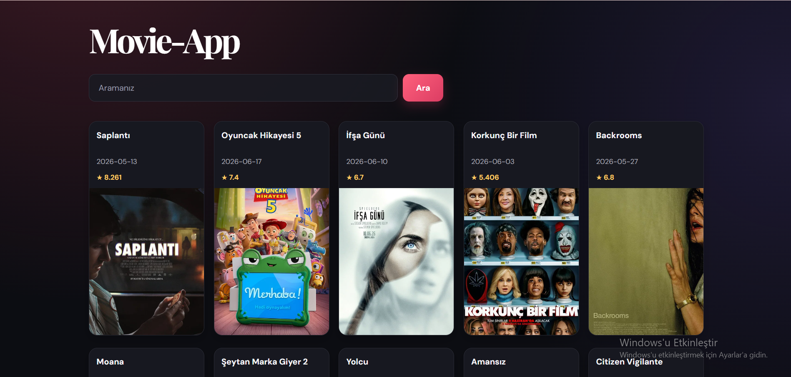
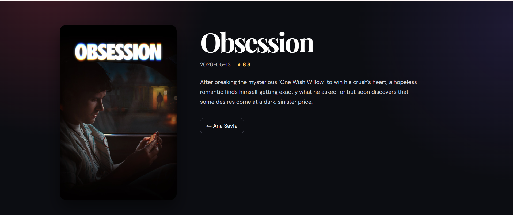

# Movie-App

A modern movie discovery application built with React and the TMDB API. Browse popular movies, search by title, and open a dedicated page for each movie.

## Preview

### Home page



### Movie details



## Features

- Browse popular movies from TMDB
- Search movies by title
- View posters, release dates, and ratings
- Open a dedicated details page for each movie
- Loading, error, and empty-state feedback
- Responsive dark user interface
- Dynamic movie details with React Router


## Built With

- [React](https://react.dev/)
- [Vite](https://vite.dev/)
- [React Router](https://reactrouter.com/)
- [TMDB API](https://www.themoviedb.org/documentation/api)
- CSS

## Getting Started

### 1. Clone the repository

```bash
git clone https://github.com/yigityilmaz16/movie-app.git
cd movie-app
```

### 2. Install dependencies

```bash
npm install
```

### 3. Add your TMDB token

Create a `.env` file in the project root and add your TMDB Read Access Token:

```env
VITE_TMDB_TOKEN=your_tmdb_read_access_token
```

### 4. Run the app

```bash
npm run dev
```

Open the local URL shown in the terminal.

## Usage

1. The home page loads popular movies automatically.
2. Enter a title in the search field and select **Search**.
3. Select a movie card to view its details.

## Important Note

Your `.env` file contains a private API token and should not be committed to Git. It is already excluded through `.gitignore`.

## Author

Yiğit Yılmaz

GitHub: https://github.com/yigityilmaz16
